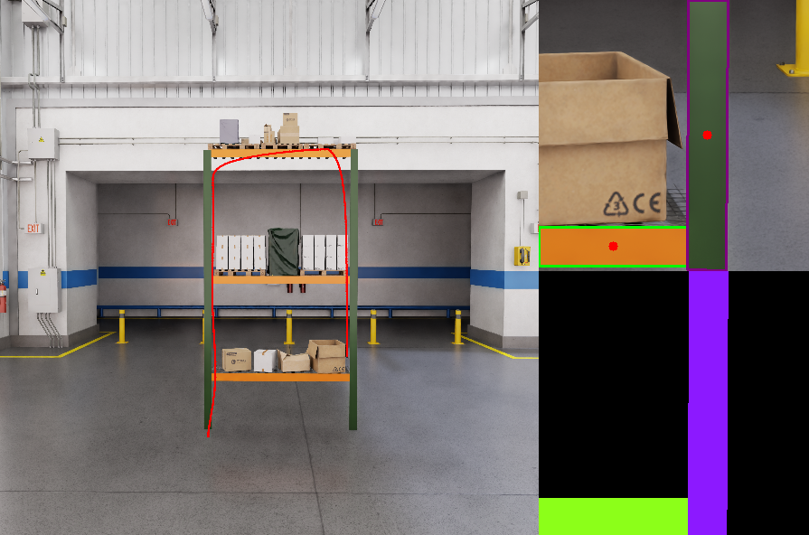

# Software Robotics Spring Co-op 2025 Assignment Visual Servoing

### Additional dependencies

```bash
- PyYAML    # pip install pyyaml
- argparse
```

### File Structure

```bash
├── images/
│   ├── canvas_single_tower.png
│   ├── mask_single_tower.png
├── src/
│   ├── base_visual_servoing.py
│   ├── controller_integrator.py
│   ├── helpers.py
│   ├── main.py
│   ├── state_parameters.yaml
│   ├── visualization.png
│   ├── visualizer.py
└── README.md
```

Make sure the `/images` folder is in place before running the `main.py`.  

## Usage

You can run the simulation by executing the `main.py` file with various command-line arguments.

### Command-line Options

The following command-line arguments are supported:

- `--integrator`: Choose the integration method for the simulation. Options are:
  - `euler`: Use the Euler integration method (default).
  - `RK`: Use the Runge-Kutta integration method.

- `--controller`: Choose the controller type for the simulation. Options are:
  - `PD`: Proportional-Derivative controller (default).
  - `PID`: Proportional-Integral-Derivative controller.

- `--visualize`: Enable or disable visualization of the simulation. Options are:
  - `True`: Enable visualization (default).
  - `False`: Disable visualization.

- `--config`: Specify the path to the configuration file containing the state parameters (default: `src/state_parameters.yaml`).

### Example

```
python3 src/main.py --controller PID --integrator RK --visualize True

To list all options
python3 src/main.py --help
```

## Methodology

### Trajectory Logic for Visual Servoing

The trajectory logic is insprired from **State Machine** designed to ensure that the drone can traverse the tower rack by detecting visual features and adjusting its path accordingly. The flexibility of the approach lies in the use of a YAML file for configuration, which allows the system to adapt to similar but different rack structures with minimal modifications to the file and no changes to the main code. 

The YAML file defines the different states of the drone's movement and specifies parameters like error offsets, counters for tracking bars, and state transitions. By adjusting the values in this file, you can easily adapt the drone's behavior to different warehouse racks, minimizing the need for hard-coding.

Example state -
```
"climb_purple": {                     # state name
    "bar_label": "vertical",          # attribute to make sure this bounding box is used for control
    "error_offsets": {                # error offsets to control movement
      "px": -30,                      # offset of -0.1m in x (300px = 1m)
      "py": 500                       # offset to move upwards
    },
    "counter": "green",               # To count green bars detected
    "counter_threshold": 2,           # if counter excede 2, change state
    "next_state": "travel_green",     # next state name
    "count_difference_values": [1],   # condition to increment counter
    "message": "Onto Green bar"       # message before state change
  }
```

### State & Control Inputs

The states and control inputs of the system are defined in a three-dimensional space The body frame of the drone aligns with the world frame.

```
X = [x, y, z, theta, x_dot, y_dot, z_dot].T     # states
u = [thrust, roll_rate, y_ddot].T               # control inputs
```
where gravity = 9.81m/s^2, drag_coeff = 4

### Dynamic equations

The vehicle dynamics for the 4DOF robotic vehicle.

```
x_ddot = thrust * sin(theta) - drag_coeff * x_dot
y_ddot = y_ddot - drag_coeff * y_dot
z_ddot = thrust * cos(theta) - gravity - drag_coeff * z_dot
theta_dot = roll_rate
```


### 3D to 2D Projection equation

To project the 3D world points (drone states) to 2D (canvas plane) for visual servoing the following equations are used. Here the frame is at the bottom left corner of the canvas.

```
u = f * X / Z                     # f in pixels, (X, Z) in meters 
y = f * Y / Z + canvas_size       # (f, canvas size) in pixels, (Y, Z) in meters 
```

### Controllers for Visual Servoing

To generate appropriate commands using the visual information received from the camera view.
 
### PD
The equation for a PD (Proportional-Derivative) controller is:
```

u(t) = Kp * e(t) + Kd * de(t)/dt

```
Where:
- **Proportional Term**: `Kp * e(t)` acts on the present error.
- **Derivative Term**: `Kd * de(t)/dt` predicts future error based on its rate of change.


### PID
The equation for a PID (Proportional-Integral-Derivative) controller is:
```

u(t) = Kp * e(t) + Ki * ∫ e(τ) dτ + Kd * de(t)/dt

```
Where:
- **Proportional Term**: `Kp * e(t)` acts on the present error.
- **Integral Term**: `Ki * ∫ e(τ) dτ` accounts for the accumulated past errors.
- **Derivative Term**: `Kd * de(t)/dt` predicts future error based on its rate of change.

### Integrators

Integrate the system dynamics over each time step

#### Euler
Euler integration is a simple numerical method to approximate the solution of ordinary differential equations (ODEs). The basic equation for Euler integration is:

```
x(n+1) = x(n) + dt * x_dot(n) 
```

#### Runge-Kutta 
The Runge-Kutta 4th Order (RK4) method is a more accurate numerical technique to solve ordinary differential equations (ODEs) compared to Euler integration. The basic equations for RK4 are:

```
x(n+1) = x(n) + (dt / 6) * (k1 + 2*k2 + 2*k3 + k4)

k1 = f(x(n), t(n))

k2 = f(x(n) + (dt / 2) * k1, t(n) + dt / 2)

k3 = f(x(n) + (dt / 2) * k2, t(n) + dt / 2)

k4 = f(x(n) + dt * k3, t(n) + dt)
```

### Visualization output

Left image: Trajectory projected to canvas

Top Right image: camera view with detected bounding box

Bottom Left image: masked camera view



### Limitations and potential solutions

- I currently use a 3D to 2D projection to find the center of the camera view and crop a 300x300 image around it to simulate the camera's perspective. However, this approach limits the field of view (FOV) to a fixed size, which doesn't reflect changes when the drone moves toward or away from the canvas. As a result, it becomes difficult to control forward movement. A potential solution is to incorporate the camera's actual FOV and resize the image to 300x300, maintaining a sense of depth. By using the width of the bounding boxes, we could then generate input to better control the drone's forward motion. 

- Another limitation is the inability to use the drone's states as input to the controller, which prevents leveraging the states and dynamics for implementing more advanced controllers like LQR or MPC. These controllers consider the robot's dynamics to generate optimal control inputs. Additionally, tuning the gains of PD and PID controllers is time-consuming and relies on trial and error, which doesn't guarantee the best performance. Incorporating more sophisticated control strategies could lead to more efficient and reliable control of the drone's movements.
